# VerCrypt

- [VerCrypt](#vercrypt)
  - [weiterführende Links](#weiterführende-links)
  - [Herunterladen](#herunterladen)
  - [Installieren](#installieren)
  - [Container(-datei) erstellen (einmalig!)](#container-datei-erstellen-einmalig)
  - [Container(-datei) einbinden](#container-datei-einbinden)
  - [Mit Container(-datei) mit wichtigen Dingen füllen](#mit-container-datei-mit-wichtigen-dingen-füllen)
  - [Container(-datei) trennen](#container-datei-trennen)

VeraCrypt ist eine Software zur Datenverschlüsselung, insbesondere zur
vollständigen oder partiellen Verschlüsselung von Festplatten und
Wechseldatenträgern. VeraCrypt ist Freie Software.

Achtung es gibt anders als bei BitLockler keinen Wiederherstellungsschlüssel.
Wenn Passwort verlorgen oder vergessen, dann sind die Daten futsch.

Vorteil: VeraCrypt ist flexibel einsetzbar unter Windows / Linux / MacOS.

Besonderheit: Container(-datei) als virtuelles Laufwerk!

## weiterführende Links
- https://www.veracrypt.fr/
- https://www.heise.de/select/ct/2020/17/2017718561505911688
- https://www.heise.de/tipps-tricks/VeraCrypt-Alles-verschluesselt-4308944.html

## Herunterladen

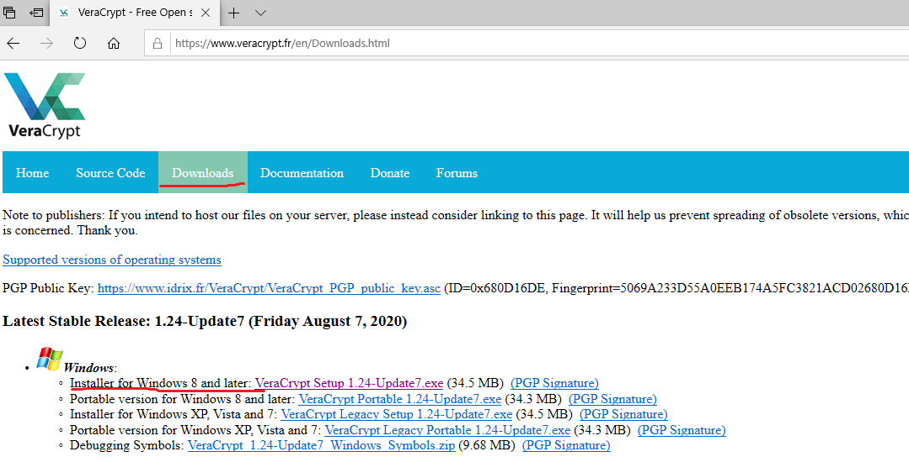

## Installieren

Den Installationsanweisungen folgen!

## Container(-datei) erstellen (einmalig!)

VeraCrypt öffnen und ein Volumen erstellen.

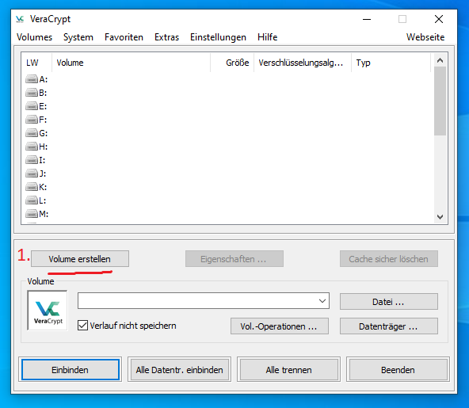

Eine verschlüsselte Containerdatei erstellen.

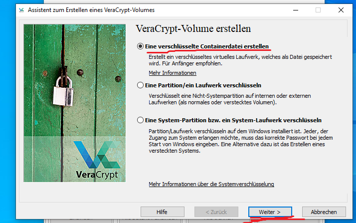

Volume-Typ `Standard VeraCrypt-Volume` auswählen.

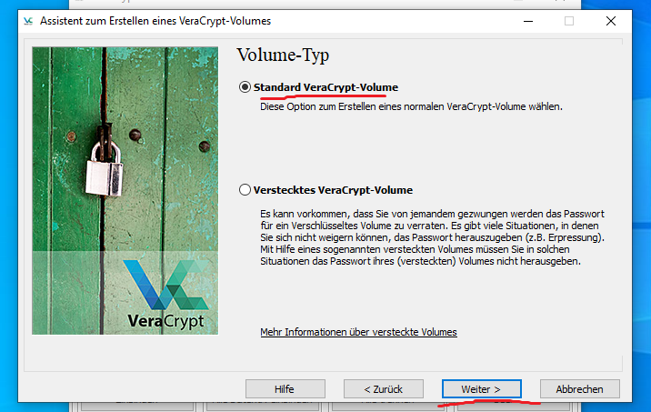

Speicherort für die Container(-datei) angeben.

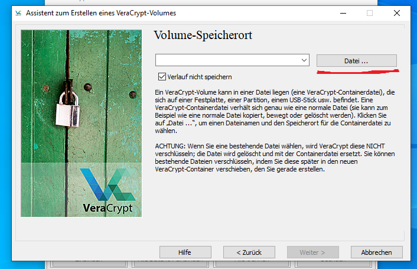

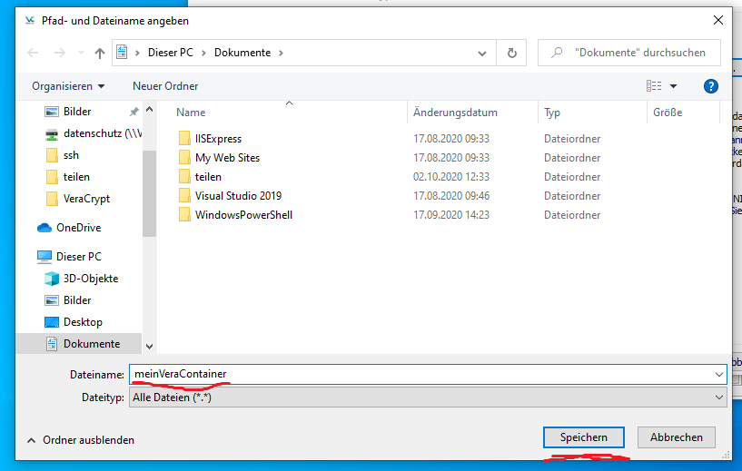

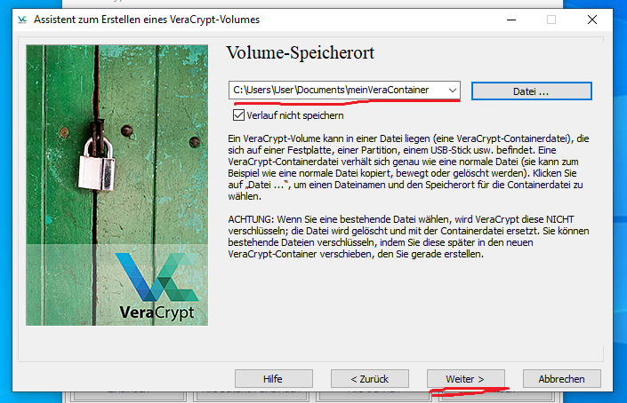

Verschlüsselungseinstellungen auswählen. **Tipp: Standardvorgaben beibehalten!**
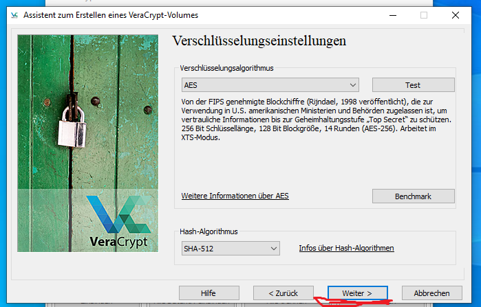

Volumen-Größe angeben. **Tipp: Zu Anfang erstmal klein beginnen.** Denn je größer desto länger dauert der Erstellungsprozeß!

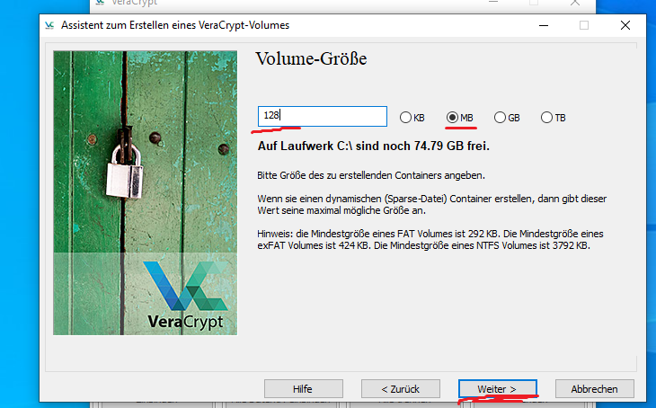

Volume-Passwort erstellen.

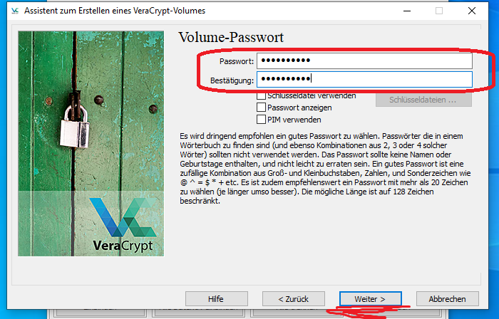

Volume-Format einstellen. **Tipp: Vorgaben beibehalten. Und die Maus solange bewegen bis der Balken grün ist.**

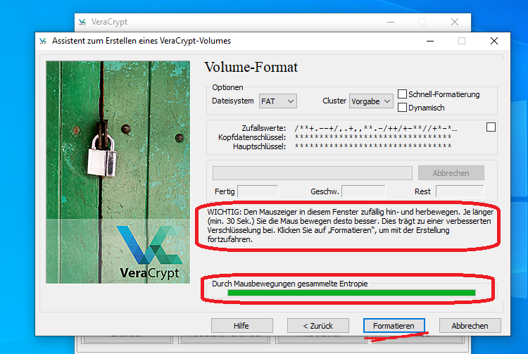

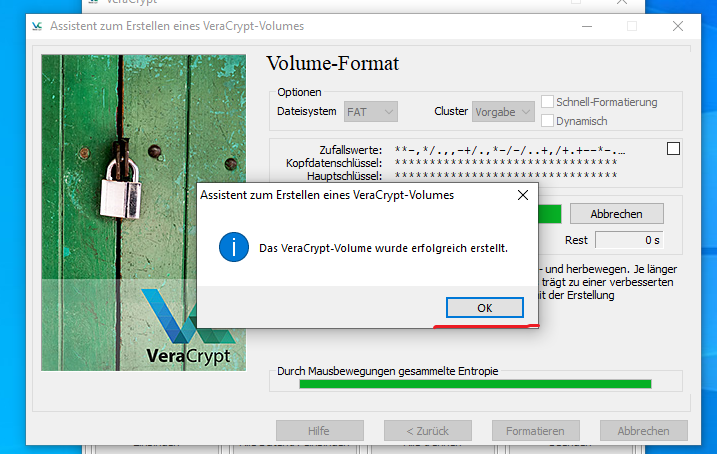

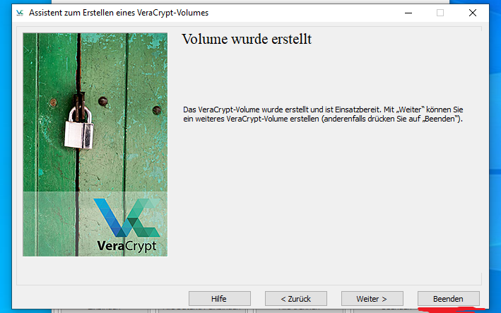

## Container(-datei) einbinden

Nachdem die Container(-datei) erstellt wurde. Muss diese explizit geöffnet und eingebunden werden. Erst dann können in dem Container die zu schützenden Dateien abgelegt werden!

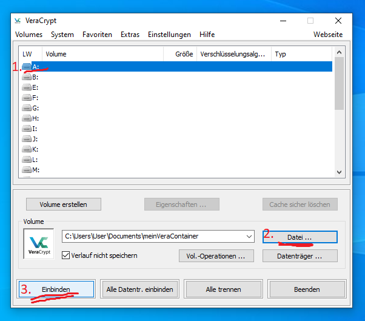

Das Passwort eingeben, damit der Container geöffnet und eingebunden werden kann.

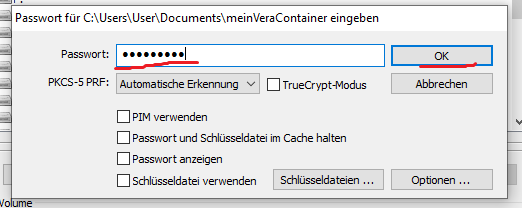

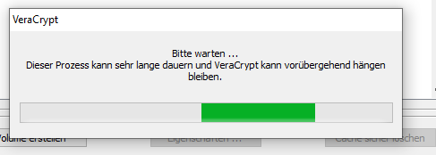

Die Container(-datei) sollte nun unter `Laufwerk A:` geöffnet und eingebunden sein.

**Tipp: Das Programm VeraCrypt kann nun beendet werden! Ein Arbeiten mit Laufwerk A: ist trotzdem weiterhin möglich.**

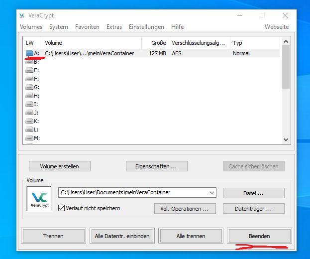

## Mit Container(-datei) mit wichtigen Dingen füllen

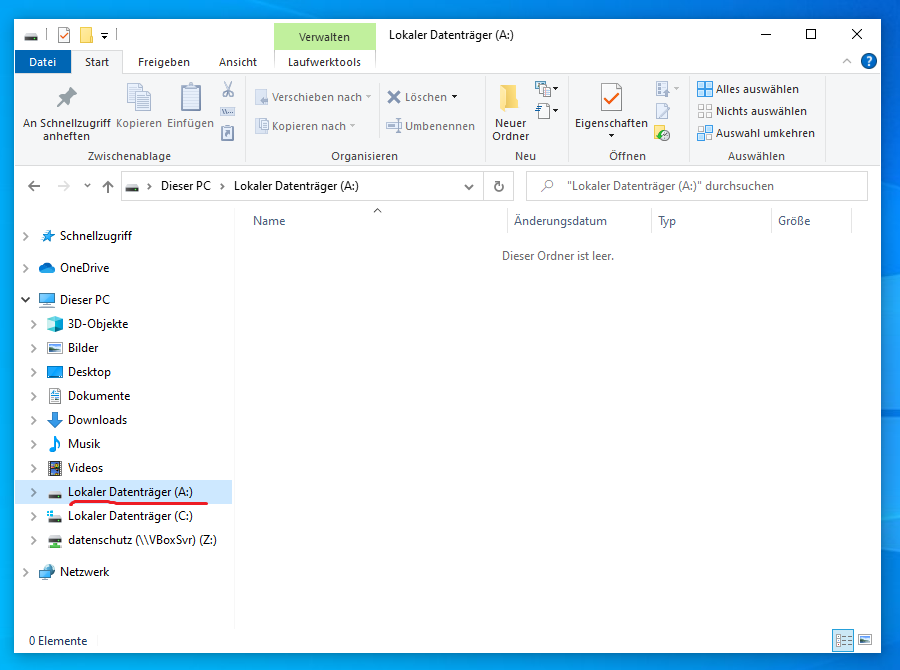

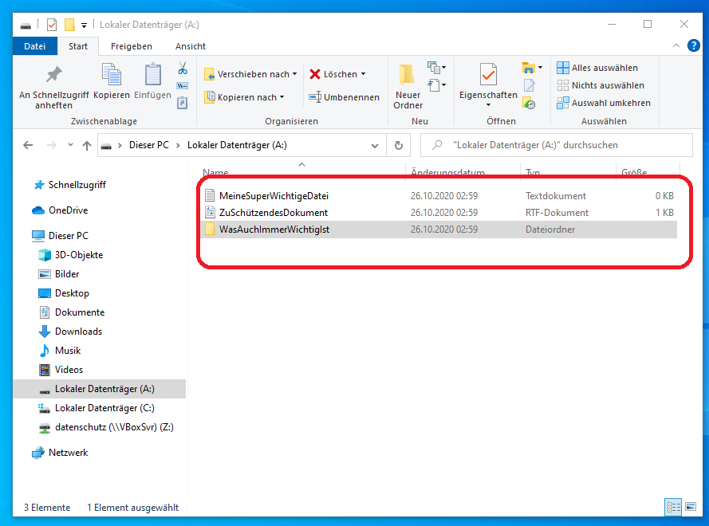

**Wichtig: Nach dem Ablegen oder dem Bearbeiten der zu schützenden Dateien muss die Container(-datei) wieder getrennt werden, damit die Daten in dem Container geschützt sind!** 

## Container(-datei) trennen

Das Programm VeraCrypt öffnen.

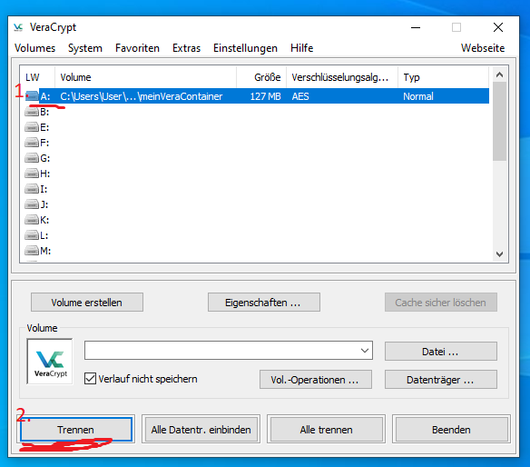

Nach dem Trennen sollte die Laufwerksübersicht leer sein!

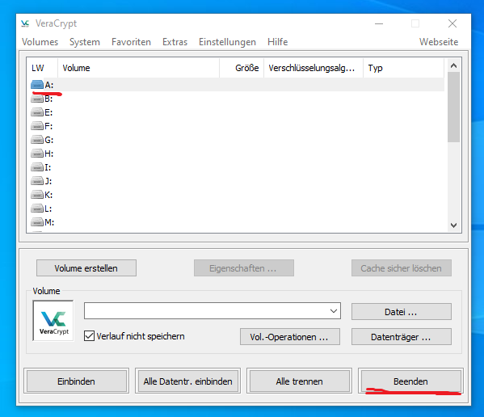

Und das `Laufwerk A:`im Datei-Explorer ist nicht mehr vorhanden. Erst dann sind die Dateien im Container sicher verschlüsselt.

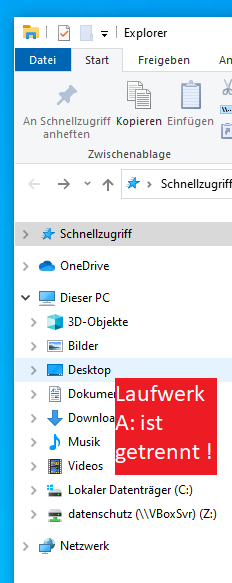

Viel Erfolg beim Verschlüsseln!